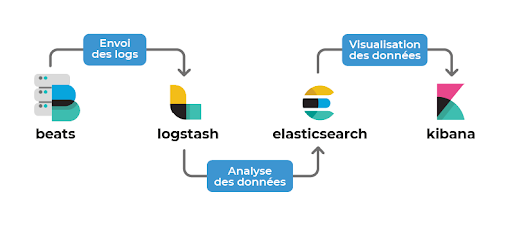

# Monitore EKS cluster with ELK (Elasticsearch Logstach Kibana)

<p align="center"></p>

----

This repo provides the steps to deploy an ELK stack to monitore an EKS cluster. In this example, we will use a single EC2 instance for the ELK stack (this is not recommended in production).

----

## Prepare your EC2

Open these ports :

- 22 (SSH)
- 9200 (Elasticsearch)
- 5601 (Kibana)
- 5044 (Logstash, si utilisé)


## Install ELK stack

```
./install_elk.sh
```
